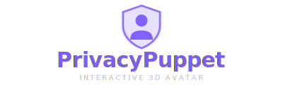
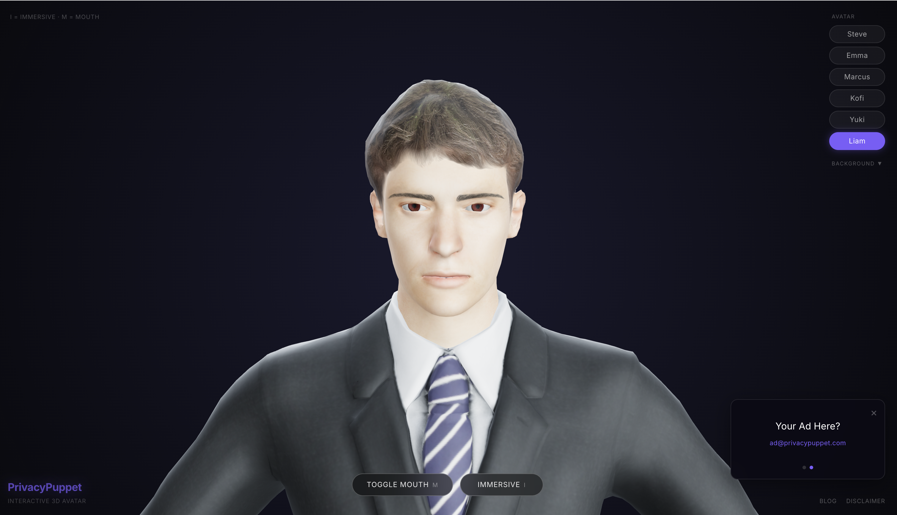

<div align="center">
  

  <p><strong>Interactive 3D avatar viewer — real-time head tracking, jaw animation, eye movement, and idle breathing.</strong><br/>
  Runs entirely in the browser. No server. No tracking. Static export to any CDN.</p>

  <a href="https://github.com/TowyTowy/privacypuppet/blob/main/LICENSE"></a>
  
  
  
</div>

<div align="center">
  
</div>

---

## Features

- **Mouse & touch head tracking** — avatar follows your cursor or finger in real time
- **Jaw animation** — toggle mouth open/close on demand
- **Eye movement & blinking** — procedural gaze and random blinks
- **Idle breathing** — subtle sway and jitter keep the avatar alive
- **Multiple backgrounds** — gradient themes + photorealistic environments
- **Immersive mode** — hide all UI for a clean presentation view
- **Static export** — `npm run build` outputs to `/out`, deploys to any CDN

## Tech Stack

| Layer | Technology |
|---|---|
| Framework | Next.js 16 (static export) |
| 3D rendering | React Three Fiber + Three.js |
| Language | TypeScript |
| Styling | Tailwind CSS 4 |
| Models | MakeHuman / MPFB2 → Blender → GLB |

## Getting Started

```bash
npm install
npm run dev       # http://localhost:3000
npm run build     # static export → /out
```

## Project Structure

```
├── public/
│   ├── mpfb_models/        # Open-source MakeHuman GLB models
│   │   ├── kofi-v2.glb
│   │   ├── yuki-v2.glb
│   │   └── liam-v2.glb
│   └── backgrounds/        # Photorealistic background images
├── src/
│   ├── app/
│   │   ├── layout.tsx      # Root layout & metadata
│   │   └── page.tsx        # UI, model/background selectors, keyboard shortcuts
│   └── components/
│       ├── Head.tsx         # Core avatar renderer (morph targets + bone animation)
│       ├── Controls.tsx     # Mouse/touch tracking, jaw toggle, idle sway
│       ├── Scene.tsx        # Three.js canvas, lighting, background system
│       └── ErrorBoundary.tsx
├── README.md
├── LICENSE
└── .gitignore
```

## How It Works

### `Head.tsx` — Avatar Renderer
Handles two fundamentally different animation systems transparently:

- **Morph-target path** (Avaturn-compatible models) — drives blend shapes for facial expressions
- **Bone-based path** (MakeHuman/MPFB models) — quaternion rotation with rest-pose offsets, clamped ranges, and procedural eye gaze

Both paths consume the same normalized pitch/yaw input from `Controls.tsx`.

### `Controls.tsx` — Input & Animation Driver
Maps mouse/touch position to head rotation and drives idle sway, jaw lerp, and blink timing.

### `Scene.tsx` — Three.js Canvas
Camera, lighting, and background system. Backgrounds are CSS gradients or dynamically loaded image textures.

### `page.tsx` — UI Shell
Model/background selection, keyboard shortcuts, mobile detection, loading state. The `MODELS` array is the single source of truth for available avatars.

## Adding Your Own Model

1. Build a humanoid in **MakeHuman** or **MPFB2**, export to Blender → GLB
2. Drop the `.glb` into `public/mpfb_models/`
3. Add an entry to `MODELS` in `src/app/page.tsx`:

```ts
{
  name: "Alex",
  url: "/mpfb_models/alex.glb",
  position: [0, -1.45, 0],
  scale: 1,
}
```

Adjust `position` Y to center the avatar in viewport. The bone-detection logic in `Head.tsx` handles MakeHuman rigs automatically.

> **Using an Avaturn model?** The morph-target code path is still present — point the URL at an Avaturn-exported GLB and the renderer switches to blend-shape animation automatically.

## Keyboard Shortcuts

| Key | Action |
|---|---|
| `I` | Toggle immersive mode |
| `M` | Toggle mouth open/close |

Click anywhere (desktop) or tap the exit button (mobile) to leave immersive mode.

## License

MIT — see [LICENSE](LICENSE)
