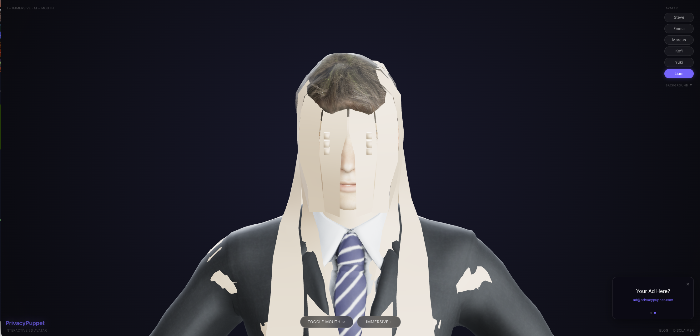
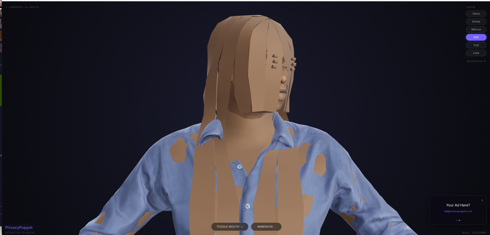
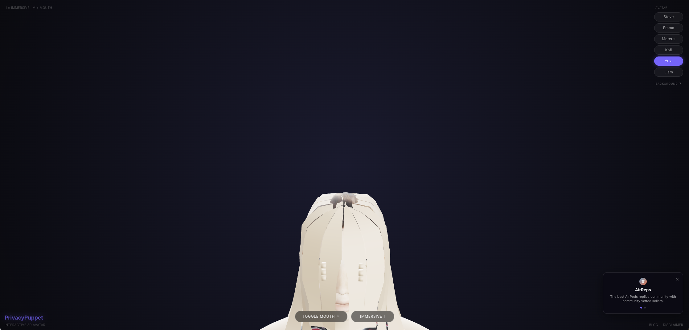

# PrivacyPuppet

**Interactive 3D avatar viewer** — real-time head tracking, jaw animation, eye movement, idle breathing, and multiple backgrounds. Runs entirely in the browser with no server-side processing.

<p align="center">
  
  
</p>

---

## Features

- **Mouse & touch head tracking** — the avatar follows your cursor or finger
- **Jaw animation** — open/close the mouth on demand
- **Eye movement & blinking** — procedural gaze and random blinks
- **Idle breathing** — subtle sway and jitter keep the avatar feeling alive
- **Multiple backgrounds** — gradient themes + photorealistic environments
- **Immersive mode** — hide all UI for a clean, distraction-free view
- **Static export** — deploys to any CDN with `npm run build`

## Tech Stack

| Layer | Technology |
|---|---|
| Framework | Next.js 16 (static export) |
| 3D rendering | React Three Fiber + Three.js |
| Language | TypeScript |
| Styling | Tailwind CSS 4 |
| Models | MakeHuman / MPFB2 → Blender → GLB |

## Getting Started

```bash
# Install dependencies
npm install

# Start development server
npm run dev

# Build static export (outputs to /out)
npm run build
```

Open [http://localhost:3000](http://localhost:3000) in your browser.

## Project Structure

```
├── public/
│   ├── mpfb_models/        # Open-source MakeHuman GLB models
│   │   ├── kofi-v2.glb
│   │   ├── yuki-v2.glb
│   │   └── liam-v2.glb
│   └── backgrounds/        # Photorealistic background images
├── src/
│   ├── app/
│   │   ├── layout.tsx      # Root layout & metadata
│   │   └── page.tsx        # UI, model/background selectors, keyboard shortcuts
│   └── components/
│       ├── Head.tsx         # Core avatar renderer (morph targets + bone animation)
│       ├── Controls.tsx     # Mouse/touch tracking, jaw toggle, idle sway
│       ├── Scene.tsx        # Three.js canvas, lighting, background system
│       └── ErrorBoundary.tsx
├── README.md
├── LICENSE
└── .gitignore
```

## How It Works

### `Head.tsx` — Avatar Renderer
The core component handles two fundamentally different animation systems:

- **Morph-target path** (Avaturn-compatible models) — drives blend shapes directly for facial expressions
- **Bone-based path** (MakeHuman/MPFB models) — uses quaternion rotation with rest-pose offsets, clamped rotation ranges, and procedural eye gaze

Both paths share the same input: normalized head pitch/yaw from `Controls.tsx`.

### `Controls.tsx` — Input & Animation Driver
Captures mouse and touch position, maps it to head rotation angles, and drives:
- Head yaw (left/right) and pitch (up/down)
- Idle sway with subtle jitter
- Jaw open/close lerp
- Random blink timing

### `Scene.tsx` — Three.js Canvas
Sets up the camera, lighting, and background. Backgrounds are either CSS gradient strings or image textures loaded dynamically. The canvas fills the viewport with `dpr` capped for performance.

### `page.tsx` — UI Shell
Manages model/background selection state, keyboard shortcuts, mobile detection, and the loading indicator. The `MODELS` array is the single source of truth for which avatars are available.

## Adding Your Own Model

1. Create or download a humanoid model in **MakeHuman** or **MPFB2**
2. Export to Blender, rig if needed, then export as **GLB**
3. Place the `.glb` in `public/mpfb_models/`
4. Add an entry to the `MODELS` array in `src/app/page.tsx`:

```ts
{
  name: "Alex",
  url: "/mpfb_models/alex.glb",
  position: [0, -1.45, 0],
  scale: 1,
}
```

Tweak `position` (Y offset) and `scale` until the avatar is centered in the viewport. The bone-detection logic in `Head.tsx` handles MakeHuman rigs automatically.

> **Bringing your own Avaturn model?** The morph-target code path is still present — just point the URL at an Avaturn-exported GLB and the renderer will switch to blend-shape animation automatically.

## Keyboard Shortcuts

| Key | Action |
|---|---|
| `I` | Toggle immersive mode (hides all UI) |
| `M` | Toggle mouth open/close |

In immersive mode: click anywhere (desktop) or tap the exit button (mobile) to return.

## License

MIT — see [LICENSE](LICENSE)

---

<p align="center">
  
</p>
